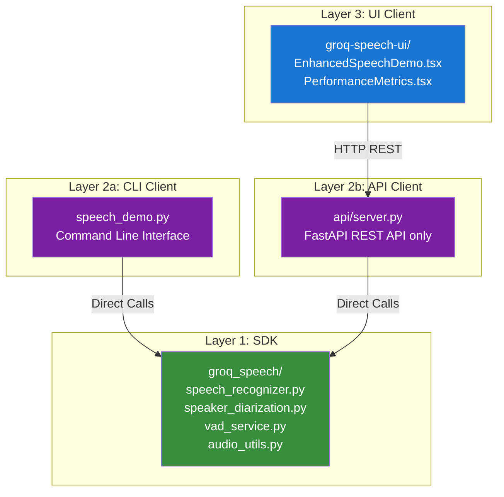

# Groq Speech SDK

A comprehensive speech recognition and translation SDK with speaker diarization capabilities, featuring both CLI and web interfaces.

## 🚀 **Quick Start**

### **Prerequisites**
- Python 3.8+
- Node.js 18+ (for web UI)
- Groq API key
- Hugging Face token (for diarization)

### **Installation**

1. **Clone the repository:**
```bash
git clone <repository-url>
cd groq-speech
```

2. **Install Python dependencies:**
```bash
pip install -r requirements.txt
```

3. **Install frontend dependencies:**
```bash
cd examples/groq-speech-ui
npm install
```

4. **Configure environment:**
```bash
cp groq_speech/env.template groq_speech/.env
# Edit groq_speech/.env with your API keys
```

### **Usage**

#### **CLI Interface (Direct SDK Access)**
```bash
# File transcription
python examples/speech_demo.py --file audio.wav

# File transcription with diarization
python examples/speech_demo.py --file audio.wav --diarize

# Microphone single mode
python examples/speech_demo.py --microphone-mode single

# Microphone continuous mode with diarization
python examples/speech_demo.py --microphone-mode continuous --diarize

# Translation mode
python examples/speech_demo.py --file audio.wav --operation translation --diarize
```

#### **Web Interface (REST API)**
```bash
# Start API server
cd api && python server.py

# Start frontend (in another terminal)
cd examples/groq-speech-ui && npm run dev

# Open http://localhost:3000
```

## 🏗️ **Architecture**

### **3-Layer Architecture**



### **Key Components**

#### **Core SDK (`groq_speech/`)**
- **`speech_recognizer.py`** - Main orchestrator, handles all speech processing
- **`speech_config.py`** - Configuration management with factory methods
- **`speaker_diarization.py`** - Speaker diarization using Pyannote.audio
- **`vad_service.py`** - Voice Activity Detection service
- **`audio_utils.py`** - Audio format utilities and conversion
- **`exceptions.py`** - Custom exception classes
- **`result_reason.py`** - Result status enums

#### **API Server (`api/`)**
- **`server.py`** - FastAPI server with REST endpoints only
- **`models/`** - Pydantic request/response models
- **REST API** - HTTP endpoints for all operations

#### **Frontend (`examples/groq-speech-ui/`)**
- **`EnhancedSpeechDemo.tsx`** - Main UI component with all features
- **`audio-recorder.ts`** - Unified audio recording (standard + optimized)
- **`continuous-audio-recorder.ts`** - VAD-based continuous recording
- **`client-vad-service.ts`** - Client-side Voice Activity Detection
- **`audio-converter.ts`** - Unified audio conversion (standard + optimized)
- **`groq-api.ts`** - REST API client

## 🔄 **Data Flow**

### **CLI Flow (Direct Access)**
```
Audio Input → numpy array → SDK Processing → Console Output
```

### **Web UI Flow (REST API)**
```
Audio Input → Frontend Processing → HTTP REST → API Server → SDK Processing → JSON Response → UI Display
```

### **Audio Format Handling**
- **File Processing**: Base64-encoded WAV → HTTP REST → base64 decode → numpy array
- **Microphone Processing**: Float32Array → HTTP REST → array conversion → numpy array
- **VAD Processing**: Client-side for real-time performance

## 🎯 **Features**

### **Speech Recognition**
- ✅ File-based transcription
- ✅ Microphone single mode
- ✅ Microphone continuous mode with VAD
- ✅ Real-time audio level visualization
- ✅ Silence detection and chunking

### **Translation**
- ✅ File-based translation
- ✅ Microphone translation
- ✅ Multi-language support
- ✅ Target language configuration

### **Speaker Diarization**
- ✅ Pyannote.audio integration
- ✅ GPU acceleration support
- ✅ Multi-speaker detection
- ✅ Speaker-specific segments

### **Voice Activity Detection (VAD)**
- ✅ Client-side real-time processing
- ✅ 15-second silence detection
- ✅ Audio level visualization
- ✅ Automatic chunk creation

### **Performance Optimizations**
- ✅ Unified audio recorders (standard + optimized)
- ✅ Unified audio converters (standard + optimized)
- ✅ Client-side VAD for real-time processing
- ✅ Chunked processing for large files
- ✅ Memory-efficient operations

## 🔌 **API Endpoints**

### **Core Endpoints**
- `POST /api/v1/recognize` - File transcription
- `POST /api/v1/translate` - File translation
- `POST /api/v1/recognize-microphone` - Single microphone processing
- `POST /api/v1/recognize-microphone-continuous` - Continuous microphone processing

### **Utility Endpoints**
- `GET /health` - Health check
- `GET /api/v1/models` - Available models
- `GET /api/v1/languages` - Supported languages
- `POST /api/log` - Frontend logging

### **VAD Endpoints (Legacy)**
- `POST /api/v1/vad/should-create-chunk` - VAD chunk detection
- `POST /api/v1/vad/audio-level` - Audio level analysis

## 🐳 **Deployment**

### **Docker (Local Development)**
```bash
# Standard deployment
docker-compose -f deployment/docker/docker-compose.yml up

# GPU-enabled deployment
docker-compose -f deployment/docker/docker-compose.gpu.yml up

# Development with hot reload
docker-compose -f deployment/docker/docker-compose.dev.yml up
```

### **GCP Cloud Run (Production)**
```bash
# Deploy to Cloud Run with GPU support
cd deployment/gcp
./deploy.sh
```

## 📊 **Performance**

### **CLI Performance**
- **Direct SDK access** - No network overhead
- **Real-time VAD** - Local processing
- **Memory efficient** - Direct numpy array handling

### **Web UI Performance**
- **Client-side VAD** - Real-time silence detection
- **Unified components** - Optimized for both short and long audio
- **Chunked processing** - Handles large files efficiently
- **REST API** - Scalable and maintainable

## 🔧 **Configuration**

### **Environment Variables**
```bash
# Required
GROQ_API_KEY=your_groq_api_key

# Optional (for diarization)
HF_TOKEN=your_huggingface_token

# Optional (for GPU support)
CUDA_VISIBLE_DEVICES=0
```

### **Audio Settings**
- **Sample Rate**: 16kHz (standard)
- **Channels**: Mono (1 channel)
- **Format**: Float32Array (microphone), WAV (files)
- **VAD Threshold**: 0.003 RMS (conservative detection)

## 📚 **Documentation**

- **[Architecture Guide](docs/ARCHITECTURE.md)** - Detailed system architecture
- **[API Reference](groq_speech/API_REFERENCE.md)** - SDK API documentation
- **[Deployment Guide](deployment/README.md)** - Deployment instructions
- **[Code Analysis](docs/CODE_ANALYSIS.md)** - Detailed code analysis

## 🤝 **Contributing**

1. Fork the repository
2. Create a feature branch
3. Make your changes
4. Add tests if applicable
5. Submit a pull request

## 📄 **License**

This project is licensed under the MIT License - see the LICENSE file for details.

## 🆘 **Support**

For issues and questions:
1. Check the [documentation](docs/)
2. Review [existing issues](https://github.com/your-repo/issues)
3. Create a new issue with detailed information

---

**Built with ❤️ using Groq, Pyannote.audio, and modern web technologies.**