# Groq Speech SDK - Complete Architecture Analysis

## 🏗️ **Overall Architecture Overview**

The Groq Speech SDK has **3 main components**:

1. **`groq_speech/`** - Core Python SDK (speech processing engine)
2. **`api/`** - FastAPI backend server (REST API only)
3. **`examples/groq-speech-ui/`** - Next.js frontend (React UI)

## 📁 **File Structure & Purpose**

### **Core SDK (`groq_speech/`)**
- **`speech_recognizer.py`** - Main orchestrator class, handles all speech processing
- **`speech_config.py`** - Configuration management for API keys, models, etc.
- **`speaker_diarization.py`** - Speaker diarization using Pyannote.audio
- **`vad_service.py`** - Voice Activity Detection
- **`exceptions.py`** - Custom exception classes
- **`result_reason.py`** - Result status enums

### **API Server (`api/`)**
- **`server.py`** - FastAPI server with REST API endpoints only
- **`models/requests.py`** - Pydantic request models
- **`models/responses.py`** - Pydantic response models

### **Frontend (`examples/groq-speech-ui/`)**
- **`src/app/page.tsx`** - Main page component
- **`src/components/EnhancedSpeechDemo.tsx`** - Main UI component with all features
- **`src/components/PerformanceMetrics.tsx`** - Performance metrics visualization
- **`src/lib/groq-api.ts`** - REST API client for backend communication
- **`src/lib/audio-recorder.ts`** - Audio recording utilities
- **`src/lib/continuous-audio-recorder.ts`** - VAD-based continuous recording
- **`src/lib/vad-service.ts`** - Voice Activity Detection service
- **`src/lib/audio-converter.ts`** - Audio format conversion utilities
- **`src/lib/optimized-audio-converter.ts`** - Optimized audio conversion
- **`src/lib/optimized-audio-recorder.ts`** - Optimized audio recording
- **`src/lib/frontend-logger.ts`** - Frontend logging utilities
- **`src/types/index.ts`** - TypeScript type definitions

## 🔄 **Flow Comparison: CLI vs Web UI**

#### **CLI Pattern (Direct Access):**
- **Layer 2a → Layer 1**: Direct function calls
- **No network boundaries**: All processing happens in the same process
- **Simplest path**: CLI calls SDK methods directly

#### **Web UI Pattern (Network Access):**
- **Layer 3 → Layer 2b**: HTTP REST requests only
- **Layer 2b → Layer 1**: Direct function calls (same as CLI)
- **Network boundaries**: UI and API run in separate processes
- **More complex**: Requires serialization/deserialization of data

#### **Key Boundary Crossings:**
1. **UI → API**: 
   - File processing: Audio converted to base64, sent via HTTP REST
   - Microphone processing: Audio converted to Float32Array (as JSON array), sent via HTTP REST
2. **API → SDK**: Same direct calls as CLI, but with decoded audio data
3. **SDK → API**: Results returned as Python objects
4. **API → UI**: Results serialized to JSON, sent via HTTP REST

## **Architecture Diagrams**

### **Overall System Architecture**


### **CLI Flow Pattern**


### **Web UI Flow Pattern**


### **Data Flow Transformations**


### **1. File Transcription (`--file test1.wav`)**

#### **CLI Flow (Direct Layer Access):**


#### **Web UI Flow (Multi-Layer with Network Boundaries):**
```mermaid
sequenceDiagram
    participant User
    participant UI as Layer 3: UI Client
    participant API as Layer 2b: API Client
    participant SDK as Layer 1: SDK
    
    User->>UI: Select "File Transcription" → Upload file
    UI->>UI: AudioRecorder.processFile() → Convert to base64
    UI->>API: GroqAPIClient.processAudio() → HTTP POST /api/v1/recognize
    API->>API: recognize_speech() endpoint
    API->>API: Decode base64 audio → Convert to numpy array
    API->>SDK: recognizer.recognize_audio_data() → Same as CLI
    SDK->>SDK: AudioProcessor.process_audio()
    SDK->>SDK: GroqAPIClient.transcribe()
    SDK->>SDK: ResponseParser.parse_response()
    SDK->>API: SpeechRecognitionResult
    API->>UI: RecognitionResponse → HTTP response
    UI->>User: Display transcription result
```

### **2. File Transcription with Diarization (`--file test1.wav --diarize`)**

#### **CLI Flow (Direct Layer Access):**
```mermaid
sequenceDiagram
    participant User
    participant CLI as Layer 2a: CLI Client
    participant SDK as Layer 1: SDK
    
    User->>CLI: python speech_demo.py --file test1.wav --diarize
    CLI->>CLI: process_audio_file(enable_diarization=True)
    CLI->>SDK: recognizer.process_file(audio_file, enable_diarization=True, is_translation=False)
    SDK->>SDK: Pyannote.audio → Speaker Detection
    SDK->>SDK: Audio Chunking → Speaker-specific segments
    SDK->>SDK: Groq API per segment → Accurate transcription
    SDK->>CLI: DiarizationResult with speaker segments
    CLI->>User: Display transcription with speaker attribution
```

#### **Web UI Flow (Multi-Layer with Network Boundaries):**
```mermaid
sequenceDiagram
    participant User
    participant UI as Layer 3: UI Client
    participant API as Layer 2b: API Client
    participant SDK as Layer 1: SDK
    
    User->>UI: Select "File Transcription + Diarization" → Upload file
    UI->>UI: AudioRecorder.processFile() → Convert to base64
    UI->>API: GroqAPIClient.processAudio(enableDiarization=true) → HTTP POST /api/v1/recognize
    API->>API: recognize_speech(enable_diarization=True)
    API->>API: Save to temp file for diarization
    API->>SDK: recognizer.process_file(temp_path, enable_diarization=True) → Same as CLI
    SDK->>SDK: Pyannote.audio → Speaker Detection
    SDK->>SDK: Audio Chunking → Speaker-specific segments
    SDK->>SDK: Groq API per segment → Accurate transcription
    SDK->>API: DiarizationResult with speaker segments
    API->>UI: RecognitionResponse with segments → HTTP response
    UI->>User: Display transcription with speaker attribution
```

### **3. Microphone Single Mode (`--microphone-mode single`)**

#### **CLI Flow (Direct Layer Access):**
```mermaid
sequenceDiagram
    participant User
    participant CLI as Layer 2a: CLI Client
    participant SDK as Layer 1: SDK
    
    User->>CLI: python speech_demo.py --microphone-mode single
    CLI->>CLI: process_microphone_single()
    CLI->>CLI: PyAudio recording → Convert to numpy array
    CLI->>SDK: recognizer.recognize_audio_data(audio_data, is_translation=False)
    SDK->>SDK: AudioProcessor.process_audio()
    SDK->>SDK: GroqAPIClient.transcribe()
    SDK->>SDK: ResponseParser.parse_response()
    SDK->>CLI: SpeechRecognitionResult
    CLI->>User: Display transcription result
```

#### **Web UI Flow (Multi-Layer with REST API):**
```mermaid
sequenceDiagram
    participant User
    participant UI as Layer 3: UI Client
    participant API as Layer 2b: API Client
    participant SDK as Layer 1: SDK
    
    User->>UI: Select "Single Microphone" → Start recording
    UI->>UI: AudioRecorder.startRecording() → Web Audio API
    User->>UI: Stop recording
    UI->>UI: Convert to Float32Array
    UI->>API: GroqAPIClient.processAudio() → HTTP POST /api/v1/recognize-microphone
    API->>API: recognize_microphone_single() endpoint
    API->>API: Convert JSON array to numpy array
    API->>SDK: recognizer.recognize_audio_data() → Same as CLI
    SDK->>SDK: AudioProcessor.process_audio()
    SDK->>SDK: GroqAPIClient.transcribe()
    SDK->>SDK: ResponseParser.parse_response()
    SDK->>API: SpeechRecognitionResult
    API->>UI: RecognitionResponse → HTTP response
    UI->>User: Display transcription result
```

### **4. Microphone Single with Diarization (`--microphone-mode single --diarize`)**

#### **CLI Flow (Direct Layer Access):**
```mermaid
sequenceDiagram
    participant User
    participant CLI as Layer 2a: CLI Client
    participant SDK as Layer 1: SDK
    
    User->>CLI: python speech_demo.py --microphone-mode single --diarize
    CLI->>CLI: process_microphone_single(enable_diarization=True)
    CLI->>CLI: PyAudio recording → Save to temp file
    CLI->>SDK: recognizer.process_file(temp_path, enable_diarization=True)
    SDK->>SDK: Pyannote.audio → Speaker Detection
    SDK->>SDK: Audio Chunking → Speaker-specific segments
    SDK->>SDK: Groq API per segment → Accurate transcription
    SDK->>CLI: DiarizationResult with speaker segments
    CLI->>User: Display transcription with speaker attribution
```

#### **Web UI Flow (Multi-Layer with REST API):**
```mermaid
sequenceDiagram
    participant User
    participant UI as Layer 3: UI Client
    participant API as Layer 2b: API Client
    participant SDK as Layer 1: SDK
    
    User->>UI: Select "Single Microphone + Diarization" → Start recording
    UI->>UI: AudioRecorder.startRecording() → Web Audio API
    User->>UI: Stop recording
    UI->>UI: Convert to Float32Array
    UI->>API: GroqAPIClient.processAudio(enableDiarization=true) → HTTP POST /api/v1/recognize-microphone
    API->>API: recognize_microphone_single() with diarization
    API->>API: Save to temp file for diarization
    API->>SDK: recognizer.process_file(temp_path, enable_diarization=True) → Same as CLI
    SDK->>SDK: Pyannote.audio → Speaker Detection
    SDK->>SDK: Audio Chunking → Speaker-specific segments
    SDK->>SDK: Groq API per segment → Accurate transcription
    SDK->>API: DiarizationResult with speaker segments
    API->>UI: RecognitionResponse with segments → HTTP response
    UI->>User: Display transcription with speaker attribution
```

### **5. Microphone Single Translation (`--microphone-mode single --operation translation`)**

#### **CLI Flow (Direct Layer Access):**
```mermaid
sequenceDiagram
    participant User
    participant CLI as Layer 2a: CLI Client
    participant SDK as Layer 1: SDK
    
    User->>CLI: python speech_demo.py --microphone-mode single --operation translation
    CLI->>CLI: process_microphone_single(operation="translation")
    CLI->>CLI: PyAudio recording → Convert to numpy array
    CLI->>SDK: recognizer.recognize_audio_data(audio_data, is_translation=True)
    SDK->>SDK: AudioProcessor.process_audio()
    SDK->>SDK: GroqAPIClient.translate()
    SDK->>SDK: ResponseParser.parse_response()
    SDK->>CLI: SpeechRecognitionResult with translated text
    CLI->>User: Display translation result
```

#### **Web UI Flow (Multi-Layer with WebSocket Boundaries):**
```mermaid
sequenceDiagram
    participant User
    participant UI as Layer 3: UI Client
    participant API as Layer 2b: API Client
    participant SDK as Layer 1: SDK
    
    User->>UI: Select "Single Microphone Translation" → Start recording
    UI->>UI: AudioRecorder.startRecording() → Web Audio API
    User->>UI: Stop recording
    UI->>UI: Convert to base64
    UI->>API: GroqAPIClient.processAudioWithWebSocket(isTranslation=true) → WebSocket
    API->>API: WebSocket handler with translation
    API->>API: Decode base64 audio → Convert to numpy array
    API->>SDK: recognizer.recognize_audio_data(audio_data, is_translation=True) → Same as CLI
    SDK->>SDK: AudioProcessor.process_audio()
    SDK->>SDK: GroqAPIClient.translate()
    SDK->>SDK: ResponseParser.parse_response()
    SDK->>API: SpeechRecognitionResult with translated text
    API->>UI: WebSocket message with translated text → Frontend display
    UI->>User: Display translation result
```

### **6. Microphone Single Translation with Diarization (`--microphone-mode single --operation translation --diarize`)**

#### **CLI Flow (Direct Layer Access):**


#### **Web UI Flow (Multi-Layer with WebSocket Boundaries):**
```mermaid
sequenceDiagram
    participant User
    participant UI as Layer 3: UI Client
    participant API as Layer 2b: API Client
    participant SDK as Layer 1: SDK
    
    User->>UI: Select "Single Microphone Translation + Diarization" → Start recording
    UI->>UI: AudioRecorder.startRecording() → Web Audio API
    User->>UI: Stop recording
    UI->>UI: Convert to base64
    UI->>API: GroqAPIClient.processAudioWithWebSocket(isTranslation=true, enableDiarization=true) → WebSocket
    API->>API: WebSocket handler with translation + diarization
    API->>API: Save to temp file for diarization
    API->>SDK: recognizer.process_file(temp_path, enable_diarization=True, is_translation=True) → Same as CLI
    SDK->>SDK: Pyannote.audio → Speaker Detection
    SDK->>SDK: Audio Chunking → Speaker-specific segments
    SDK->>SDK: Groq API per segment → Translation
    SDK->>API: DiarizationResult with translated speaker segments
    API->>UI: WebSocket diarization_result message with translated segments → Frontend display
    UI->>User: Display translation with speaker attribution
```

### **7. Microphone Continuous Mode (`--microphone-mode continuous`)**

#### **CLI Flow (Direct Layer Access):**


#### **Web UI Flow (Multi-Layer with REST API):**
```mermaid
sequenceDiagram
    participant User
    participant UI as Layer 3: UI Client
    participant API as Layer 2b: API Client
    participant SDK as Layer 1: SDK
    
    User->>UI: Select "Continuous Microphone" → Start recording
    UI->>UI: ContinuousAudioRecorder.startRecording() → Web Audio API with VAD chunking
    loop For each chunk
        UI->>API: GroqAPIClient.processAudio() → HTTP POST /api/v1/recognize-microphone-continuous
        API->>API: recognize_microphone_continuous() processes each chunk
        API->>SDK: recognizer.recognize_audio_data() → Same as CLI
        SDK->>SDK: AudioProcessor.process_audio()
        SDK->>SDK: GroqAPIClient.transcribe()
        SDK->>SDK: ResponseParser.parse_response()
        SDK->>API: SpeechRecognitionResult
        API->>UI: RecognitionResponse for each result → HTTP response
        UI->>User: Display transcription result
    end
    User->>UI: Stop recording
    UI->>User: Continuous processing completed
```

### **8. Microphone Continuous with Diarization (`--microphone-mode continuous --diarize`)**

#### **CLI Flow (Direct Layer Access):**
```mermaid
sequenceDiagram
    participant User
    participant CLI as Layer 2a: CLI Client
    participant SDK as Layer 1: SDK
    
    User->>CLI: python speech_demo.py --microphone-mode continuous --diarize
    CLI->>CLI: process_microphone_continuous(enable_diarization=True)
    CLI->>CLI: PyAudio continuous recording → VAD chunking
    loop For each chunk
        CLI->>CLI: Save to temp file
        CLI->>SDK: recognizer.process_file(enable_diarization=True)
        SDK->>SDK: Pyannote.audio → Speaker Detection
        SDK->>SDK: Audio Chunking → Speaker-specific segments
        SDK->>SDK: Groq API per segment → Accurate transcription
        SDK->>CLI: DiarizationResult with speaker segments
        CLI->>User: Stream diarization results to console
    end
    User->>CLI: Ctrl+C to stop
    CLI->>User: Continuous diarization processing completed
```

#### **Web UI Flow (Multi-Layer with WebSocket Boundaries):**
```mermaid
sequenceDiagram
    participant User
    participant UI as Layer 3: UI Client
    participant API as Layer 2b: API Client
    participant SDK as Layer 1: SDK
    
    User->>UI: Select "Continuous Microphone + Diarization" → Start recording
    UI->>UI: AudioRecorder.startContinuousRecording() → Web Audio API with chunking
    loop For each chunk
        UI->>API: GroqAPIClient.sendAudioData(enableDiarization=true) → WebSocket
        API->>API: WebSocket handler with diarization
        API->>SDK: recognizer.process_file(temp_path, enable_diarization=True) → Same as CLI
        SDK->>SDK: Pyannote.audio → Speaker Detection
        SDK->>SDK: Audio Chunking → Speaker-specific segments
        SDK->>SDK: Groq API per segment → Accurate transcription
        SDK->>API: DiarizationResult with speaker segments
        API->>UI: WebSocket diarization_result messages → Frontend display
        UI->>User: Display diarization results
    end
    User->>UI: Stop recording
    UI->>User: Continuous diarization processing completed
```

### **9. Microphone Continuous Translation (`--microphone-mode continuous --operation translation`)**

#### **CLI Flow (Direct Layer Access):**
```mermaid
sequenceDiagram
    participant User
    participant CLI as Layer 2a: CLI Client
    participant SDK as Layer 1: SDK
    
    User->>CLI: python speech_demo.py --microphone-mode continuous --operation translation
    CLI->>CLI: process_microphone_continuous(operation="translation")
    CLI->>CLI: PyAudio continuous recording → VAD chunking
    loop For each chunk
        CLI->>SDK: recognizer.recognize_audio_data(is_translation=True)
        SDK->>SDK: AudioProcessor.process_audio()
        SDK->>SDK: GroqAPIClient.translate()
        SDK->>SDK: ResponseParser.parse_response()
        SDK->>CLI: SpeechRecognitionResult with translated text
        CLI->>User: Stream translated results to console
    end
    User->>CLI: Ctrl+C to stop
    CLI->>User: Continuous translation processing completed
```

#### **Web UI Flow (Multi-Layer with WebSocket Boundaries):**
```mermaid
sequenceDiagram
    participant User
    participant UI as Layer 3: UI Client
    participant API as Layer 2b: API Client
    participant SDK as Layer 1: SDK
    
    User->>UI: Select "Continuous Microphone Translation" → Start recording
    UI->>UI: AudioRecorder.startContinuousRecording() → Web Audio API with chunking
    loop For each chunk
        UI->>API: GroqAPIClient.sendAudioData(isTranslation=true) → WebSocket
        API->>API: WebSocket handler with translation
        API->>SDK: recognizer.recognize_audio_data(is_translation=True) → Same as CLI
        SDK->>SDK: AudioProcessor.process_audio()
        SDK->>SDK: GroqAPIClient.translate()
        SDK->>SDK: ResponseParser.parse_response()
        SDK->>API: SpeechRecognitionResult with translated text
        API->>UI: WebSocket messages with translated text → Frontend display
        UI->>User: Display translation result
    end
    User->>UI: Stop recording
    UI->>User: Continuous translation processing completed
```

### **10. Microphone Continuous Translation with Diarization (`--microphone-mode continuous --operation translation --diarize`)**

#### **CLI Flow (Direct Layer Access):**
```mermaid
sequenceDiagram
    participant User
    participant CLI as Layer 2a: CLI Client
    participant SDK as Layer 1: SDK
    
    User->>CLI: python speech_demo.py --microphone-mode continuous --operation translation --diarize
    CLI->>CLI: process_microphone_continuous(operation="translation", enable_diarization=True)
    CLI->>CLI: PyAudio continuous recording → VAD chunking
    loop For each chunk
        CLI->>CLI: Save to temp file
        CLI->>SDK: recognizer.process_file(enable_diarization=True, is_translation=True)
        SDK->>SDK: Pyannote.audio → Speaker Detection
        SDK->>SDK: Audio Chunking → Speaker-specific segments
        SDK->>SDK: Groq API per segment → Translation
        SDK->>CLI: DiarizationResult with translated speaker segments
        CLI->>User: Stream translated diarization results to console
    end
    User->>CLI: Ctrl+C to stop
    CLI->>User: Continuous translation + diarization processing completed
```

#### **Web UI Flow (Multi-Layer with WebSocket Boundaries):**
```mermaid
sequenceDiagram
    participant User
    participant UI as Layer 3: UI Client
    participant API as Layer 2b: API Client
    participant SDK as Layer 1: SDK
    
    User->>UI: Select "Continuous Microphone Translation + Diarization" → Start recording
    UI->>UI: AudioRecorder.startContinuousRecording() → Web Audio API with chunking
    loop For each chunk
        UI->>API: GroqAPIClient.sendAudioData(isTranslation=true, enableDiarization=true) → WebSocket
        API->>API: WebSocket handler with translation + diarization
        API->>SDK: recognizer.process_file(temp_path, enable_diarization=True, is_translation=True) → Same as CLI
        SDK->>SDK: Pyannote.audio → Speaker Detection
        SDK->>SDK: Audio Chunking → Speaker-specific segments
        SDK->>SDK: Groq API per segment → Translation
        SDK->>API: DiarizationResult with translated speaker segments
        API->>UI: WebSocket diarization_result messages with translated segments → Frontend display
        UI->>User: Display translation with speaker attribution
    end
    User->>UI: Stop recording
    UI->>User: Continuous translation + diarization processing completed
```

## 🔧 **Key Technical Differences**

### **Audio Processing:**
- **CLI**: Uses PyAudio for microphone input, direct numpy array processing
- **Web UI**: 
  - File processing: Uses Web Audio API, converts to base64 for transmission
  - Microphone processing: Uses Web Audio API, converts to Float32Array (JSON array) for transmission

### **API Communication:**
- **CLI**: Direct function calls to `groq_speech` module
- **Web UI**: HTTP REST API for all communication

### **Diarization Handling:**
- **CLI**: Direct file processing with `process_file()`
- **Web UI**: Same logic but through API endpoints

### **Translation Mode:**
- **CLI**: Sets `speech_config.enable_translation = True`
- **Web UI**: Passes `is_translation` parameter through API

## 🚨 **Potential Issues to Check**

1. **Audio Format Consistency**: CLI uses 16kHz, ensure Web UI matches
2. **Float32Array Conversion**: Verify audio data is properly converted between formats
3. **REST API State Management**: Check request/response handling
4. **Diarization Temp Files**: Ensure proper cleanup in API server
5. **Error Handling**: Verify consistent error responses
6. **Translation Configuration**: Ensure translation mode is properly set

## 📊 **Performance Considerations**

- **CLI**: Direct processing, fastest
- **Web UI**: Network overhead, but same core processing
- **Diarization**: Most expensive operation, requires temp files
- **Continuous Mode**: Real-time processing, REST API for chunk-based processing

## 🎯 **Layer Transition Summary**

### **Understanding the 3-Layer Architecture with Parallel Client Interfaces**

The Groq Speech SDK uses a **3-layer architecture** with **parallel client interfaces** where each layer has specific responsibilities:

#### **Layer 1: SDK (`groq_speech/`)**
- **Purpose**: Core speech processing engine
- **Key Files**: `speech_recognizer.py`, `speaker_diarization.py`, `speech_config.py`
- **Responsibilities**: Audio processing, API calls to Groq, result parsing
- **Interface**: Python functions and classes

#### **Layer 2a: CLI Client (`speech_demo.py`)**
- **Purpose**: Command-line interface for testing and demonstration
- **Key Files**: `examples/speech_demo.py`
- **Responsibilities**: User interaction, argument parsing, audio input handling
- **Interface**: Direct function calls to Layer 1

#### **Layer 2b: API Client (`api/`)**
- **Purpose**: Web API server that exposes SDK functionality
- **Key Files**: `api/server.py`
- **Responsibilities**: HTTP REST endpoints, request/response handling, data serialization
- **Interface**: HTTP REST API to Layer 3, direct calls to Layer 1

#### **Layer 3: UI Client (`groq-speech-ui/`)**
- **Purpose**: Web-based user interface
- **Key Files**: `EnhancedSpeechDemo.tsx`, `PerformanceMetrics.tsx`, `groq-api.ts`
- **Responsibilities**: User interface, audio recording, API communication
- **Interface**: HTTP REST requests to Layer 2b


### **Data Flow Transformations**

#### **Audio Data Flow:**
1. **CLI**: File/Microphone → numpy array → SDK
2. **Web UI**: 
   - File: File → base64 → HTTP REST → base64 decode → numpy array → SDK
   - Microphone: Microphone → Float32Array → HTTP REST → array conversion → numpy array → SDK

#### **Result Data Flow:**
1. **CLI**: SDK result → Console output
2. **Web UI**: SDK result → JSON serialization → HTTP REST response → JSON parsing → UI display

### **Key Insights**

1. **Same Core Logic**: Both CLI and Web UI use identical SDK processing
2. **Different Interfaces**: CLI uses direct calls, Web UI uses HTTP REST protocols
3. **Data Serialization**: Web UI requires Float32Array conversion for audio data
4. **Error Handling**: Web UI needs additional error handling for network issues
5. **Performance**: CLI is faster (no network overhead), Web UI is more accessible

## 🔌 **Current API Endpoints**

The API server provides the following REST endpoints:

### **Core Endpoints:**
- `POST /api/v1/recognize` - File transcription with base64 audio data
- `POST /api/v1/translate` - File translation with base64 audio data
- `POST /api/v1/recognize-microphone` - Single microphone processing with Float32Array
- `POST /api/v1/recognize-microphone-continuous` - Continuous microphone processing with Float32Array

### **Utility Endpoints:**
- `GET /health` - Health check endpoint
- `GET /api/v1/models` - Available Groq models
- `GET /api/v1/languages` - Supported languages
- `POST /api/log` - Frontend logging

### **Data Formats:**
- **File Processing**: Base64-encoded audio data (WAV format)
- **Microphone Processing**: Float32Array as JSON array (raw PCM data)
- **All Responses**: JSON with success/error status and results

This architecture ensures the Web UI provides the same functionality as the CLI but through a web interface with proper separation of concerns.
