# Groq Speech SDK - Architecture Design

This document provides a comprehensive architectural overview of the Groq Speech SDK, including system states, class relationships, sequence diagrams, and deployment architecture.

## 🏗️ **System Overview**

The Groq Speech SDK is designed as a **modular, extensible, and scalable** system that provides real-time speech recognition capabilities across multiple platforms and protocols.

### **Core Architecture Principles**

1. **Separation of Concerns** - Each component has a single responsibility
2. **Dependency Injection** - Loose coupling between components
3. **Event-Driven Architecture** - Asynchronous processing with callbacks
4. **API-First Design** - Multiple protocol support (REST, WebSocket, gRPC)
5. **Security by Design** - Authentication, validation, and encryption
6. **Observability** - Comprehensive logging, metrics, and monitoring

## 📊 **System Architecture Diagram**

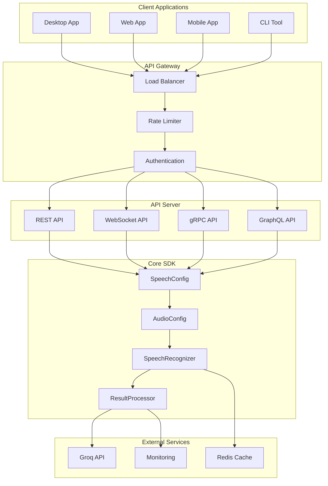
```mermaid
graph TB
    subgraph "Client Applications"
        A[Desktop App]
        B[Web App]
        C[Mobile App]
        D[CLI Tool]
    end
    
    subgraph "API Gateway"
        E[Load Balancer]
        F[Rate Limiter]
        G[Authentication]
    end
    
    subgraph "API Server"
        H[REST API]
        I[WebSocket API]
        J[gRPC API]
        K[GraphQL API]
    end
    
    subgraph "Core SDK"
        L[SpeechConfig]
        M[AudioConfig]
        N[SpeechRecognizer]
        O[ResultProcessor]
    end
    
    subgraph "External Services"
        P[Groq API]
        Q[Redis Cache]
        R[Monitoring]
    end
    
    A --> E
    B --> E
    C --> E
    D --> E
    
    E --> F
    F --> G
    G --> H
    G --> I
    G --> J
    G --> K
    
    H --> L
    I --> L
    J --> L
    K --> L
    
    L --> M
    M --> N
    N --> O
    O --> P
    
    N --> Q
    O --> R
```

## 🏛️ **Class Architecture**

### **Core SDK Classes**

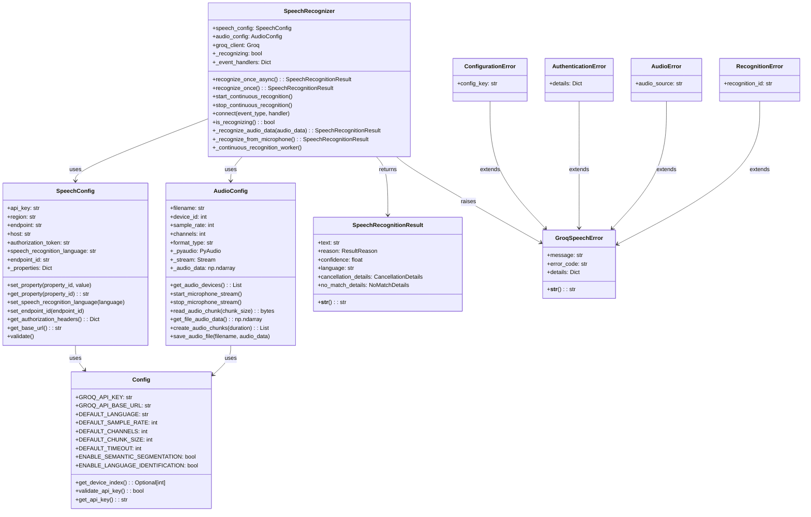
```mermaid
classDiagram
    class SpeechConfig {
        +api_key: str
        +region: str
        +endpoint: str
        +host: str
        +authorization_token: str
        +speech_recognition_language: str
        +endpoint_id: str
        +_properties: Dict
        +set_property(property_id, value)
        +get_property(property_id): str
        +set_speech_recognition_language(language)
        +set_endpoint_id(endpoint_id)
        +get_authorization_headers(): Dict
        +get_base_url(): str
        +validate()
    }
    
    class AudioConfig {
        +filename: str
        +device_id: int
        +sample_rate: int
        +channels: int
        +format_type: str
        +_pyaudio: PyAudio
        +_stream: Stream
        +_audio_data: np.ndarray
        +get_audio_devices(): List
        +start_microphone_stream()
        +stop_microphone_stream()
        +read_audio_chunk(chunk_size): bytes
        +get_file_audio_data(): np.ndarray
        +create_audio_chunks(duration): List
        +save_audio_file(filename, audio_data)
    }
    
    class SpeechRecognizer {
        +speech_config: SpeechConfig
        +audio_config: AudioConfig
        +groq_client: Groq
        +_recognizing: bool
        +_event_handlers: Dict
        +recognize_once_async(): SpeechRecognitionResult
        +recognize_once(): SpeechRecognitionResult
        +start_continuous_recognition()
        +stop_continuous_recognition()
        +connect(event_type, handler)
        +is_recognizing(): bool
        +_recognize_audio_data(audio_data): SpeechRecognitionResult
        +_recognize_from_microphone(): SpeechRecognitionResult
        +_continuous_recognition_worker()
    }
    
    class SpeechRecognitionResult {
        +text: str
        +reason: ResultReason
        +confidence: float
        +language: str
        +cancellation_details: CancellationDetails
        +no_match_details: NoMatchDetails
        +__str__(): str
    }
    
    class Config {
        +GROQ_API_KEY: str
        +GROQ_API_BASE_URL: str
        +DEFAULT_LANGUAGE: str
        +DEFAULT_SAMPLE_RATE: int
        +DEFAULT_CHANNELS: int
        +DEFAULT_CHUNK_SIZE: int
        +DEFAULT_TIMEOUT: int
        +ENABLE_SEMANTIC_SEGMENTATION: bool
        +ENABLE_LANGUAGE_IDENTIFICATION: bool
        +get_device_index(): Optional[int]
        +validate_api_key(): bool
        +get_api_key(): str
    }
    
    class GroqSpeechError {
        +message: str
        +error_code: str
        +details: Dict
        +__str__(): str
    }
    
    class ConfigurationError {
        +config_key: str
    }
    
    class AuthenticationError {
        +details: Dict
    }
    
    class AudioError {
        +audio_source: str
    }
    
    class RecognitionError {
        +recognition_id: str
    }
    
    SpeechConfig --> Config : uses
    AudioConfig --> Config : uses
    SpeechRecognizer --> SpeechConfig : uses
    SpeechRecognizer --> AudioConfig : uses
    SpeechRecognizer --> SpeechRecognitionResult : returns
    SpeechRecognizer --> GroqSpeechError : raises
    ConfigurationError --> GroqSpeechError : extends
    AuthenticationError --> GroqSpeechError : extends
    AudioError --> GroqSpeechError : extends
    RecognitionError --> GroqSpeechError : extends
```

### **API Server Classes**

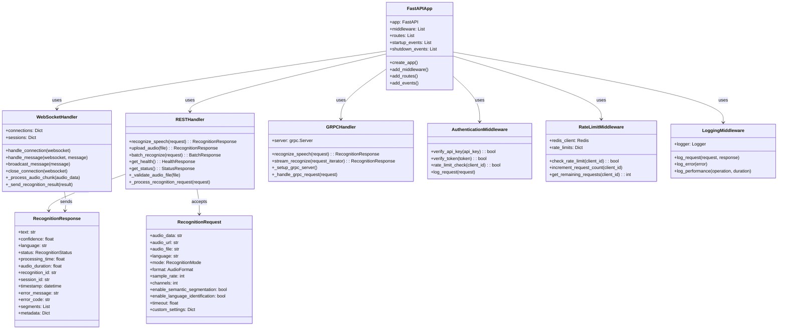
```mermaid
classDiagram
    class FastAPIApp {
        +app: FastAPI
        +middleware: List
        +routes: List
        +startup_events: List
        +shutdown_events: List
        +create_app()
        +add_middleware()
        +add_routes()
        +add_events()
    }
    
    class WebSocketHandler {
        +connections: Dict
        +sessions: Dict
        +handle_connection(websocket)
        +handle_message(websocket, message)
        +broadcast_message(message)
        +close_connection(websocket)
        +_process_audio_chunk(audio_data)
        +_send_recognition_result(result)
    }
    
    class RESTHandler {
        +recognize_speech(request): RecognitionResponse
        +upload_audio(file): RecognitionResponse
        +batch_recognize(request): BatchResponse
        +get_health(): HealthResponse
        +get_status(): StatusResponse
        +_validate_audio_file(file)
        +_process_recognition_request(request)
    }
    
    class GRPCHandler {
        +server: grpc.Server
        +recognize_speech(request): RecognitionResponse
        +stream_recognize(request_iterator): RecognitionResponse
        +_setup_grpc_server()
        +_handle_grpc_request(request)
    }
    
    class AuthenticationMiddleware {
        +verify_api_key(api_key): bool
        +verify_token(token): bool
        +rate_limit_check(client_id): bool
        +log_request(request)
    }
    
    class RateLimitMiddleware {
        +redis_client: Redis
        +rate_limits: Dict
        +check_rate_limit(client_id): bool
        +increment_request_count(client_id)
        +get_remaining_requests(client_id): int
    }
    
    class LoggingMiddleware {
        +logger: Logger
        +log_request(request, response)
        +log_error(error)
        +log_performance(operation, duration)
    }
    
    class RecognitionRequest {
        +audio_data: str
        +audio_url: str
        +audio_file: str
        +language: str
        +mode: RecognitionMode
        +format: AudioFormat
        +sample_rate: int
        +channels: int
        +enable_semantic_segmentation: bool
        +enable_language_identification: bool
        +timeout: float
        +custom_settings: Dict
    }
    
    class RecognitionResponse {
        +text: str
        +confidence: float
        +language: str
        +status: RecognitionStatus
        +processing_time: float
        +audio_duration: float
        +recognition_id: str
        +session_id: str
        +timestamp: datetime
        +error_message: str
        +error_code: str
        +segments: List
        +metadata: Dict
    }
    
    FastAPIApp --> WebSocketHandler : uses
    FastAPIApp --> RESTHandler : uses
    FastAPIApp --> GRPCHandler : uses
    FastAPIApp --> AuthenticationMiddleware : uses
    FastAPIApp --> RateLimitMiddleware : uses
    FastAPIApp --> LoggingMiddleware : uses
    RESTHandler --> RecognitionRequest : accepts
    RESTHandler --> RecognitionResponse : returns
    WebSocketHandler --> RecognitionResponse : sends
```

## 🔄 **System States**

### **Application Lifecycle States**

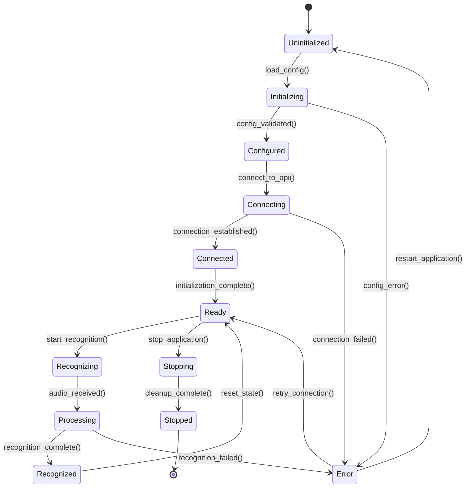
```mermaid
stateDiagram-v2
    [*] --> Uninitialized
    Uninitialized --> Initializing : load_config()
    Initializing --> Configured : config_validated()
    Initializing --> Error : config_error()
    
    Configured --> Connecting : connect_to_api()
    Connecting --> Connected : connection_established()
    Connecting --> Error : connection_failed()
    
    Connected --> Ready : initialization_complete()
    Ready --> Recognizing : start_recognition()
    Recognizing --> Processing : audio_received()
    Processing --> Recognized : recognition_complete()
    Processing --> Error : recognition_failed()
    
    Recognized --> Ready : reset_state()
    Error --> Ready : retry_connection()
    Error --> Uninitialized : restart_application()
    
    Ready --> Stopping : stop_application()
    Stopping --> Stopped : cleanup_complete()
    Stopped --> [*]
```

### **Recognition Session States**

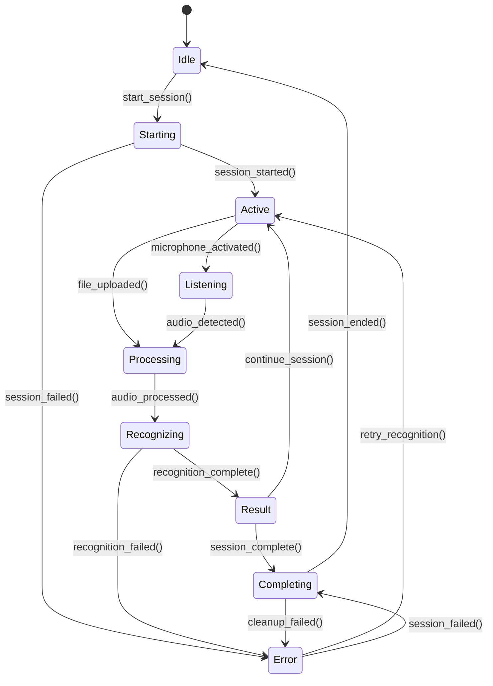
```mermaid
stateDiagram-v2
    [*] --> Idle
    Idle --> Starting : start_session()
    Starting --> Active : session_started()
    Starting --> Error : session_failed()
    
    Active --> Listening : microphone_activated()
    Active --> Processing : file_uploaded()
    
    Listening --> Processing : audio_detected()
    Processing --> Recognizing : audio_processed()
    Recognizing --> Result : recognition_complete()
    Recognizing --> Error : recognition_failed()
    
    Result --> Active : continue_session()
    Result --> Completing : session_complete()
    Error --> Active : retry_recognition()
    Error --> Completing : session_failed()
    
    Completing --> Idle : session_ended()
    Completing --> Error : cleanup_failed()
```

### **Audio Processing States**

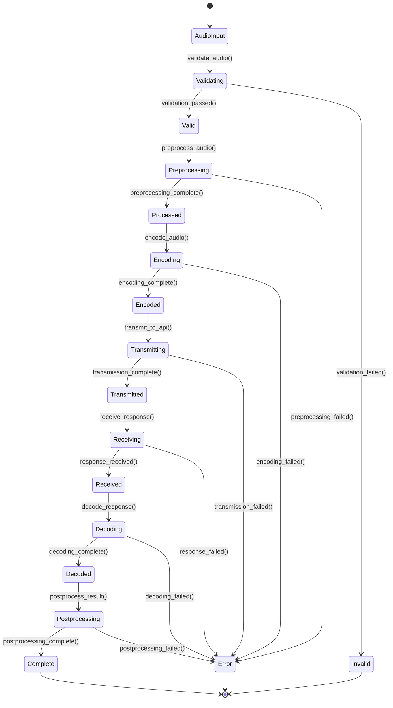
```mermaid
stateDiagram-v2
    [*] --> AudioInput
    AudioInput --> Validating : validate_audio()
    Validating --> Valid : validation_passed()
    Validating --> Invalid : validation_failed()
    
    Valid --> Preprocessing : preprocess_audio()
    Preprocessing --> Processed : preprocessing_complete()
    Preprocessing --> Error : preprocessing_failed()
    
    Processed --> Encoding : encode_audio()
    Encoding --> Encoded : encoding_complete()
    Encoding --> Error : encoding_failed()
    
    Encoded --> Transmitting : transmit_to_api()
    Transmitting --> Transmitted : transmission_complete()
    Transmitting --> Error : transmission_failed()
    
    Transmitted --> Receiving : receive_response()
    Receiving --> Received : response_received()
    Receiving --> Error : response_failed()
    
    Received --> Decoding : decode_response()
    Decoding --> Decoded : decoding_complete()
    Decoding --> Error : decoding_failed()
    
    Decoded --> Postprocessing : postprocess_result()
    Postprocessing --> Complete : postprocessing_complete()
    Postprocessing --> Error : postprocessing_failed()
    
    Complete --> [*]
    Invalid --> [*]
    Error --> [*]
```

## 🔄 **Sequence Diagrams**

### **Basic Speech Recognition Flow**

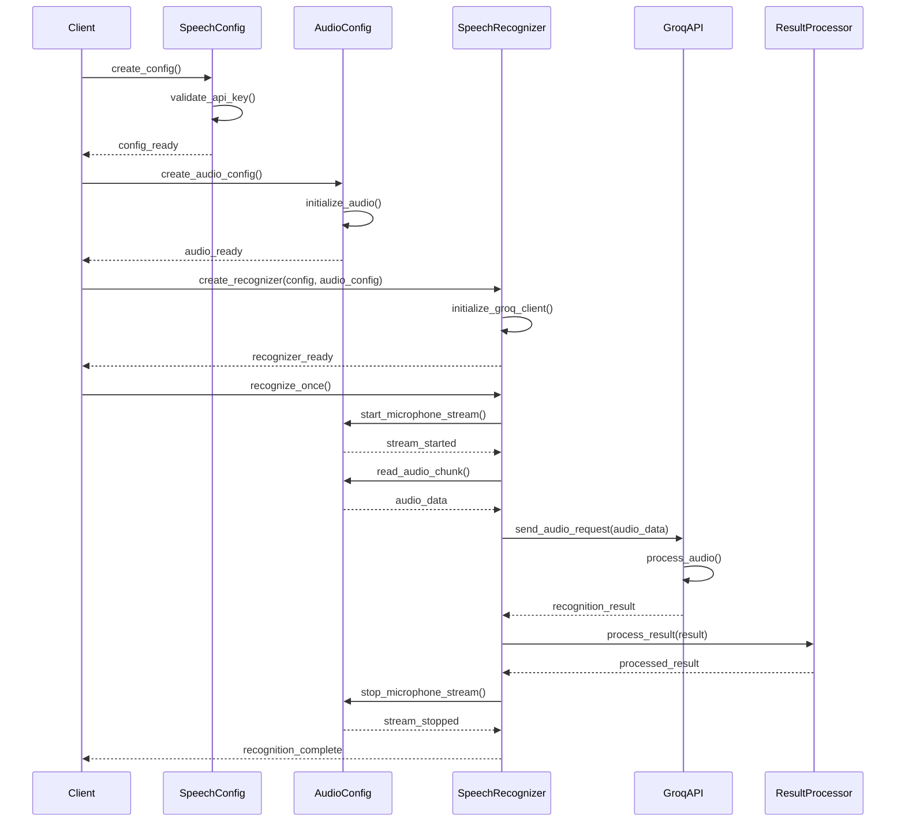
```mermaid
sequenceDiagram
    participant Client
    participant SpeechConfig
    participant AudioConfig
    participant SpeechRecognizer
    participant GroqAPI
    participant ResultProcessor
    
    Client->>SpeechConfig: create_config()
    SpeechConfig->>SpeechConfig: validate_api_key()
    SpeechConfig-->>Client: config_ready
    
    Client->>AudioConfig: create_audio_config()
    AudioConfig->>AudioConfig: initialize_audio()
    AudioConfig-->>Client: audio_ready
    
    Client->>SpeechRecognizer: create_recognizer(config, audio_config)
    SpeechRecognizer->>SpeechRecognizer: initialize_groq_client()
    SpeechRecognizer-->>Client: recognizer_ready
    
    Client->>SpeechRecognizer: recognize_once()
    SpeechRecognizer->>AudioConfig: start_microphone_stream()
    AudioConfig-->>SpeechRecognizer: stream_started
    
    SpeechRecognizer->>AudioConfig: read_audio_chunk()
    AudioConfig-->>SpeechRecognizer: audio_data
    
    SpeechRecognizer->>GroqAPI: send_audio_request(audio_data)
    GroqAPI->>GroqAPI: process_audio()
    GroqAPI-->>SpeechRecognizer: recognition_result
    
    SpeechRecognizer->>ResultProcessor: process_result(result)
    ResultProcessor-->>SpeechRecognizer: processed_result
    
    SpeechRecognizer->>AudioConfig: stop_microphone_stream()
    AudioConfig-->>SpeechRecognizer: stream_stopped
    
    SpeechRecognizer-->>Client: recognition_complete
```

### **WebSocket Real-time Recognition**

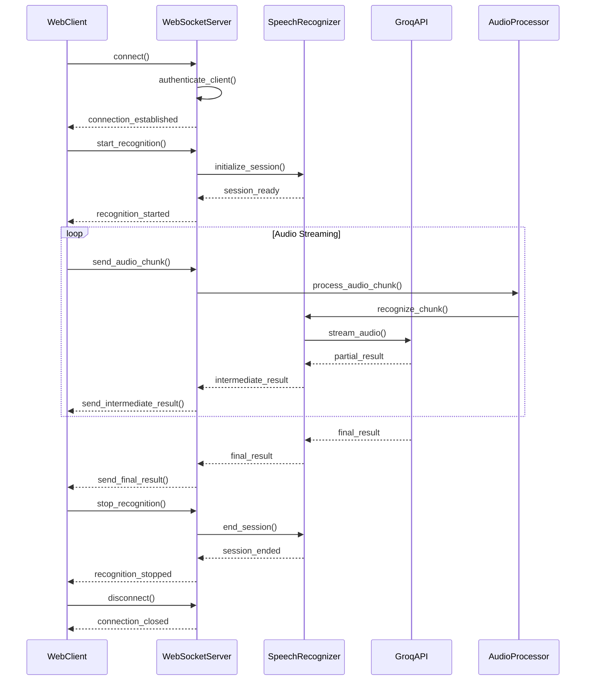
```mermaid
sequenceDiagram
    participant WebClient
    participant WebSocketServer
    participant SpeechRecognizer
    participant GroqAPI
    participant AudioProcessor
    
    WebClient->>WebSocketServer: connect()
    WebSocketServer->>WebSocketServer: authenticate_client()
    WebSocketServer-->>WebClient: connection_established
    
    WebClient->>WebSocketServer: start_recognition()
    WebSocketServer->>SpeechRecognizer: initialize_session()
    SpeechRecognizer-->>WebSocketServer: session_ready
    WebSocketServer-->>WebClient: recognition_started
    
    loop Audio Streaming
        WebClient->>WebSocketServer: send_audio_chunk()
        WebSocketServer->>AudioProcessor: process_audio_chunk()
        AudioProcessor->>SpeechRecognizer: recognize_chunk()
        SpeechRecognizer->>GroqAPI: stream_audio()
        GroqAPI-->>SpeechRecognizer: partial_result
        SpeechRecognizer-->>WebSocketServer: intermediate_result
        WebSocketServer-->>WebClient: send_intermediate_result()
    end
    
    GroqAPI-->>SpeechRecognizer: final_result
    SpeechRecognizer-->>WebSocketServer: final_result
    WebSocketServer-->>WebClient: send_final_result()
    
    WebClient->>WebSocketServer: stop_recognition()
    WebSocketServer->>SpeechRecognizer: end_session()
    SpeechRecognizer-->>WebSocketServer: session_ended
    WebSocketServer-->>WebClient: recognition_stopped
    
    WebClient->>WebSocketServer: disconnect()
    WebSocketServer-->>WebClient: connection_closed
```

### **REST API Batch Processing**

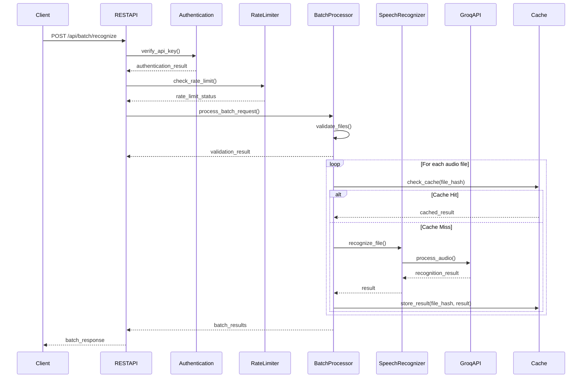
```mermaid
sequenceDiagram
    participant Client
    participant RESTAPI
    participant Authentication
    participant RateLimiter
    participant BatchProcessor
    participant SpeechRecognizer
    participant GroqAPI
    participant Cache
    
    Client->>RESTAPI: POST /api/batch/recognize
    RESTAPI->>Authentication: verify_api_key()
    Authentication-->>RESTAPI: authentication_result
    
    RESTAPI->>RateLimiter: check_rate_limit()
    RateLimiter-->>RESTAPI: rate_limit_status
    
    RESTAPI->>BatchProcessor: process_batch_request()
    BatchProcessor->>BatchProcessor: validate_files()
    BatchProcessor-->>RESTAPI: validation_result
    
    loop For each audio file
        BatchProcessor->>Cache: check_cache(file_hash)
        alt Cache Hit
            Cache-->>BatchProcessor: cached_result
        else Cache Miss
            BatchProcessor->>SpeechRecognizer: recognize_file()
            SpeechRecognizer->>GroqAPI: process_audio()
            GroqAPI-->>SpeechRecognizer: recognition_result
            SpeechRecognizer-->>BatchProcessor: result
            BatchProcessor->>Cache: store_result(file_hash, result)
        end
    end
    
    BatchProcessor-->>RESTAPI: batch_results
    RESTAPI-->>Client: batch_response
```

### **Error Handling Flow**

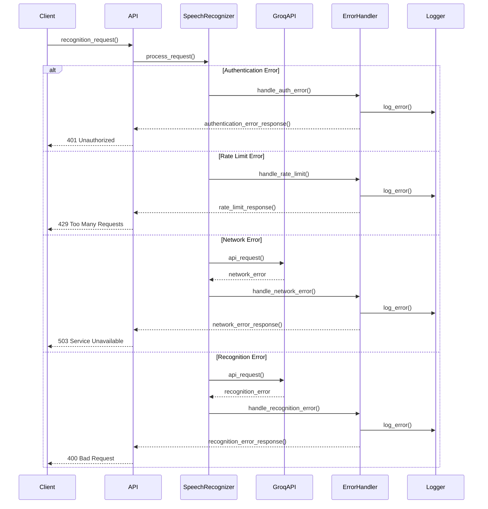
```mermaid
sequenceDiagram
    participant Client
    participant API
    participant SpeechRecognizer
    participant GroqAPI
    participant ErrorHandler
    participant Logger
    
    Client->>API: recognition_request()
    API->>SpeechRecognizer: process_request()
    
    alt Authentication Error
        SpeechRecognizer->>ErrorHandler: handle_auth_error()
        ErrorHandler->>Logger: log_error()
        ErrorHandler-->>API: authentication_error_response()
        API-->>Client: 401 Unauthorized
    else Rate Limit Error
        SpeechRecognizer->>ErrorHandler: handle_rate_limit()
        ErrorHandler->>Logger: log_error()
        ErrorHandler-->>API: rate_limit_response()
        API-->>Client: 429 Too Many Requests
    else Network Error
        SpeechRecognizer->>GroqAPI: api_request()
        GroqAPI-->>SpeechRecognizer: network_error
        SpeechRecognizer->>ErrorHandler: handle_network_error()
        ErrorHandler->>Logger: log_error()
        ErrorHandler-->>API: network_error_response()
        API-->>Client: 503 Service Unavailable
    else Recognition Error
        SpeechRecognizer->>GroqAPI: api_request()
        GroqAPI-->>SpeechRecognizer: recognition_error
        SpeechRecognizer->>ErrorHandler: handle_recognition_error()
        ErrorHandler->>Logger: log_error()
        ErrorHandler-->>API: recognition_error_response()
        API-->>Client: 400 Bad Request
    end
```

## 🏗️ **Deployment Architecture**

### **Docker Container Architecture**

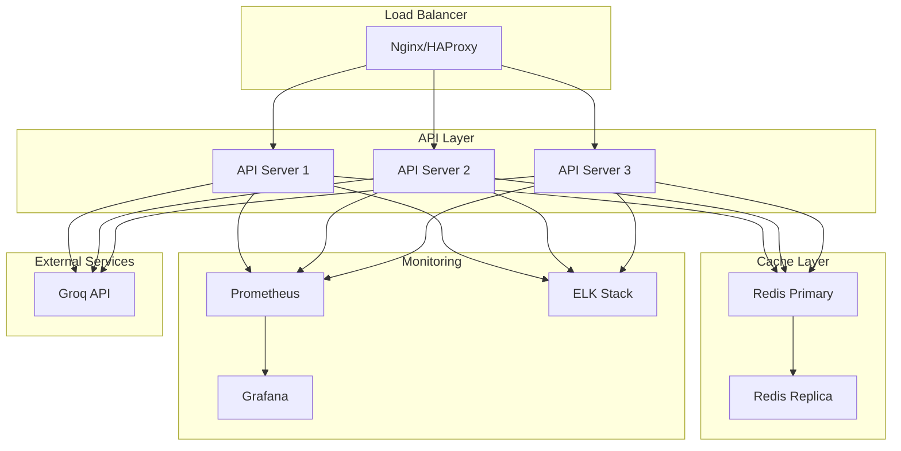
```mermaid
graph TB
    subgraph "Load Balancer"
        LB[Nginx/HAProxy]
    end
    
    subgraph "API Layer"
        API1[API Server 1]
        API2[API Server 2]
        API3[API Server 3]
    end
    
    subgraph "Cache Layer"
        REDIS1[Redis Primary]
        REDIS2[Redis Replica]
    end
    
    subgraph "Monitoring"
        PROM[Prometheus]
        GRAF[Grafana]
        LOG[ELK Stack]
    end
    
    subgraph "External Services"
        GROQ[Groq API]
    end
    
    LB --> API1
    LB --> API2
    LB --> API3
    
    API1 --> REDIS1
    API2 --> REDIS1
    API3 --> REDIS1
    
    REDIS1 --> REDIS2
    
    API1 --> GROQ
    API2 --> GROQ
    API3 --> GROQ
    
    API1 --> PROM
    API2 --> PROM
    API3 --> PROM
    
    PROM --> GRAF
    API1 --> LOG
    API2 --> LOG
    API3 --> LOG
```

### **Kubernetes Deployment**

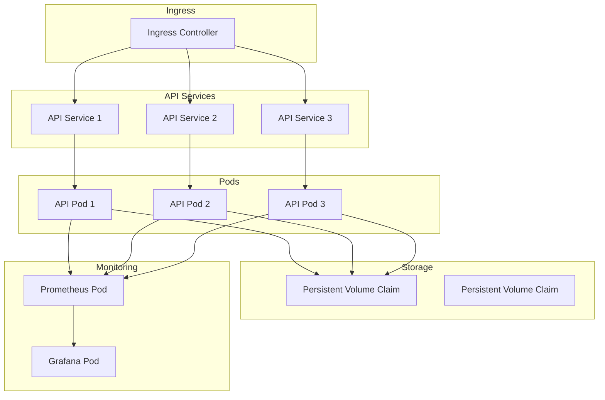
```mermaid
graph TB
    subgraph "Ingress"
        ING[Ingress Controller]
    end
    
    subgraph "API Services"
        SVC1[API Service 1]
        SVC2[API Service 2]
        SVC3[API Service 3]
    end
    
    subgraph "Pods"
        POD1[API Pod 1]
        POD2[API Pod 2]
        POD3[API Pod 3]
    end
    
    subgraph "Storage"
        PVC1[Persistent Volume Claim]
        PVC2[Persistent Volume Claim]
    end
    
    subgraph "Monitoring"
        PROM[Prometheus Pod]
        GRAF[Grafana Pod]
    end
    
    ING --> SVC1
    ING --> SVC2
    ING --> SVC3
    
    SVC1 --> POD1
    SVC2 --> POD2
    SVC3 --> POD3
    
    POD1 --> PVC1
    POD2 --> PVC1
    POD3 --> PVC1
    
    POD1 --> PROM
    POD2 --> PROM
    POD3 --> PROM
    
    PROM --> GRAF
```

## 🔧 **Configuration Architecture**

### **Configuration Hierarchy**

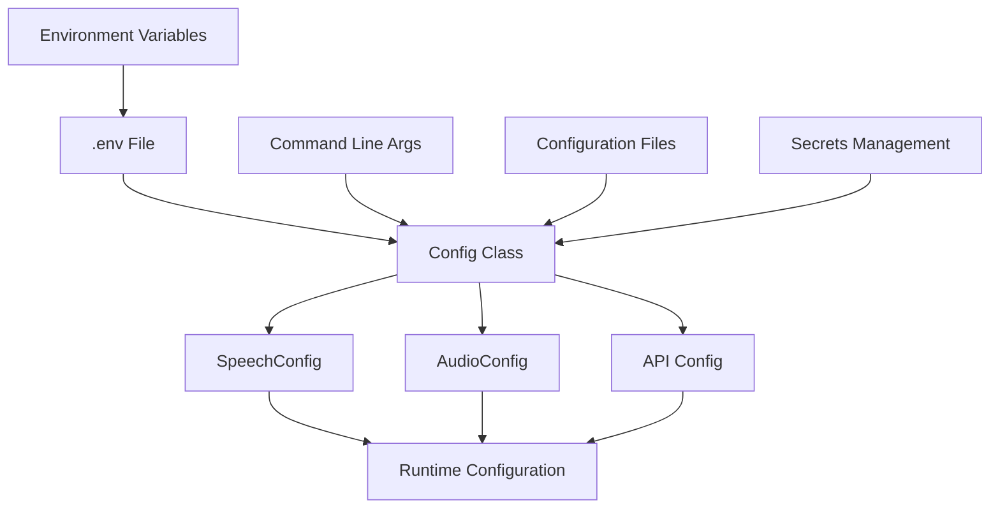
```mermaid
graph TD
    A[Environment Variables] --> B[.env File]
    B --> C[Config Class]
    C --> D[SpeechConfig]
    C --> E[AudioConfig]
    C --> F[API Config]
    
    G[Command Line Args] --> C
    H[Configuration Files] --> C
    I[Secrets Management] --> C
    
    D --> J[Runtime Configuration]
    E --> J
    F --> J
```

### **Configuration Validation Flow**

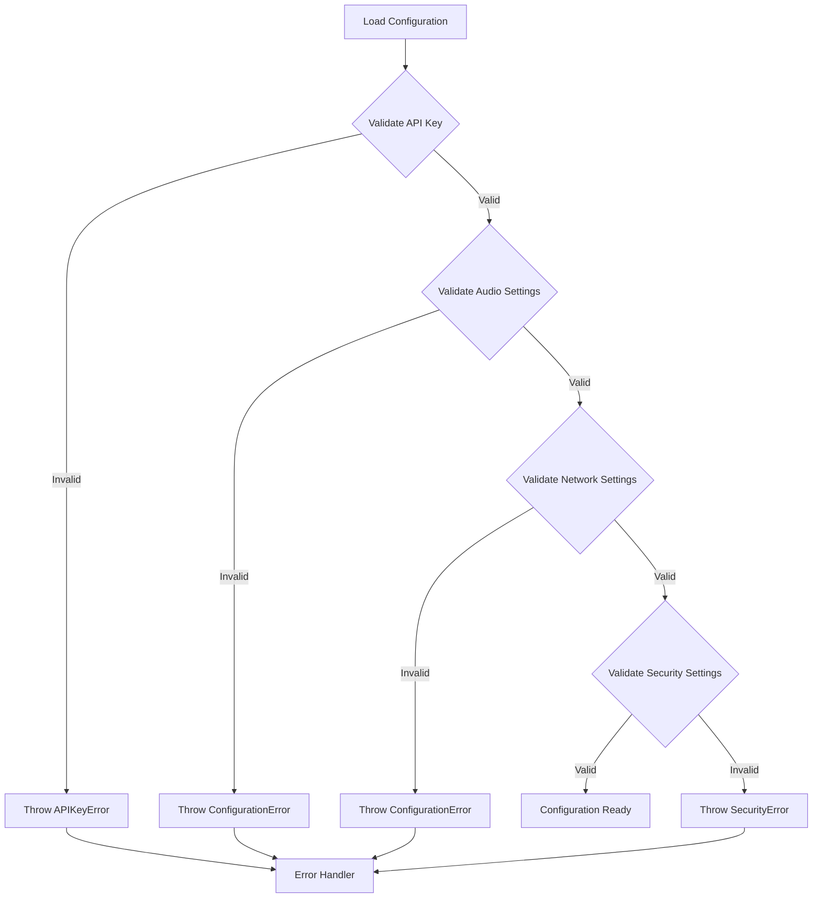
```mermaid
flowchart TD
    A[Load Configuration] --> B{Validate API Key}
    B -->|Valid| C{Validate Audio Settings}
    B -->|Invalid| D[Throw APIKeyError]
    
    C -->|Valid| E{Validate Network Settings}
    C -->|Invalid| F[Throw ConfigurationError]
    
    E -->|Valid| G{Validate Security Settings}
    E -->|Invalid| H[Throw ConfigurationError]
    
    G -->|Valid| I[Configuration Ready]
    G -->|Invalid| J[Throw SecurityError]
    
    D --> K[Error Handler]
    F --> K
    H --> K
    J --> K
```

## 📊 **Performance Architecture**

### **Caching Strategy**

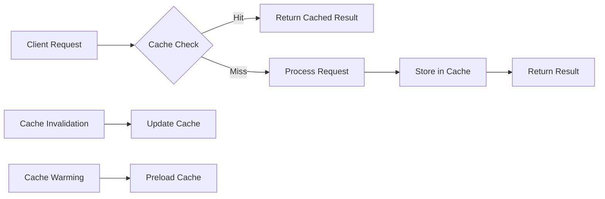
```mermaid
graph LR
    A[Client Request] --> B{Cache Check}
    B -->|Hit| C[Return Cached Result]
    B -->|Miss| D[Process Request]
    D --> E[Store in Cache]
    E --> F[Return Result]
    
    G[Cache Invalidation] --> H[Update Cache]
    I[Cache Warming] --> J[Preload Cache]
```

### **Load Balancing Strategy**

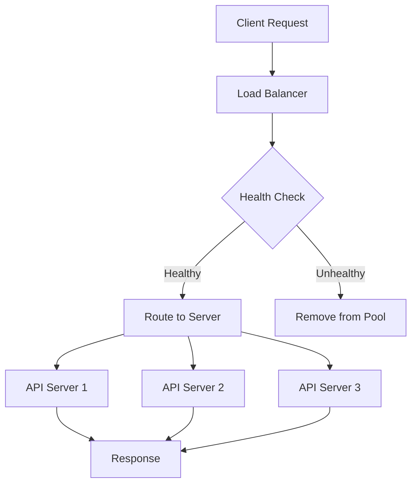
```mermaid
graph TB
    A[Client Request] --> B[Load Balancer]
    B --> C{Health Check}
    C -->|Healthy| D[Route to Server]
    C -->|Unhealthy| E[Remove from Pool]
    
    D --> F[API Server 1]
    D --> G[API Server 2]
    D --> H[API Server 3]
    
    F --> I[Response]
    G --> I
    H --> I
```

## 🔒 **Security Architecture**

### **Authentication Flow**

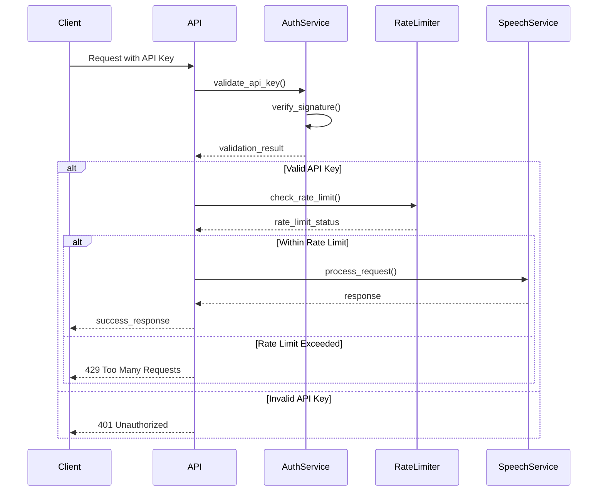
```mermaid
sequenceDiagram
    participant Client
    participant API
    participant AuthService
    participant RateLimiter
    participant SpeechService
    
    Client->>API: Request with API Key
    API->>AuthService: validate_api_key()
    AuthService->>AuthService: verify_signature()
    AuthService-->>API: validation_result
    
    alt Valid API Key
        API->>RateLimiter: check_rate_limit()
        RateLimiter-->>API: rate_limit_status
        
        alt Within Rate Limit
            API->>SpeechService: process_request()
            SpeechService-->>API: response
            API-->>Client: success_response
        else Rate Limit Exceeded
            API-->>Client: 429 Too Many Requests
        end
    else Invalid API Key
        API-->>Client: 401 Unauthorized
    end
```

### **Data Flow Security**

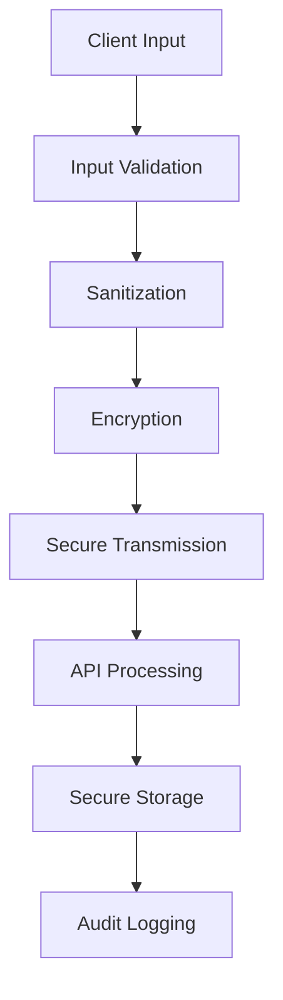
```mermaid
graph TB
    A[Client Input] --> B[Input Validation]
    B --> C[Sanitization]
    C --> D[Encryption]
    D --> E[Secure Transmission]
    E --> F[API Processing]
    F --> G[Secure Storage]
    G --> H[Audit Logging]
```

## 📈 **Monitoring Architecture**

### **Metrics Collection**

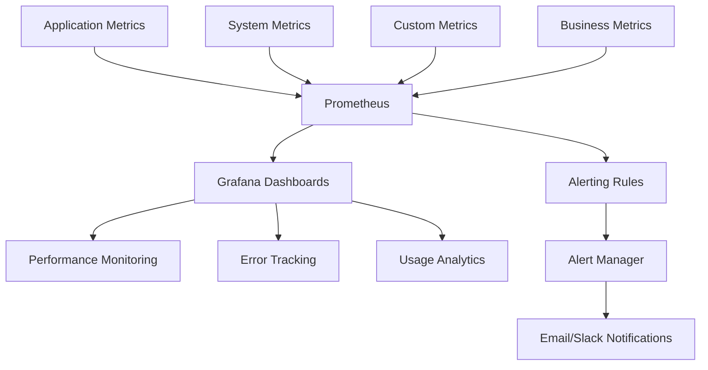
```mermaid
graph TB
    A[Application Metrics] --> B[Prometheus]
    C[System Metrics] --> B
    D[Custom Metrics] --> B
    E[Business Metrics] --> B
    
    B --> F[Grafana Dashboards]
    B --> G[Alerting Rules]
    
    F --> H[Performance Monitoring]
    F --> I[Error Tracking]
    F --> J[Usage Analytics]
    
    G --> K[Alert Manager]
    K --> L[Email/Slack Notifications]
```

### **Logging Architecture**

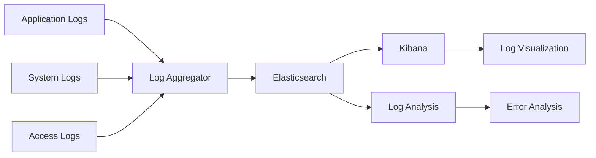
```mermaid
graph LR
    A[Application Logs] --> B[Log Aggregator]
    C[System Logs] --> B
    D[Access Logs] --> B
    
    B --> E[Elasticsearch]
    E --> F[Kibana]
    E --> G[Log Analysis]
    
    F --> H[Log Visualization]
    G --> I[Error Analysis]
```

## 🚀 **Scalability Architecture**

### **Horizontal Scaling**

```mermaid
graph TB
    A[Load Balancer] --> B[API Server 1]
    A --> C[API Server 2]
    A --> D[API Server 3]
    A --> E[API Server N]
    
    B --> F[Shared Cache]
    C --> F
    D --> F
    E --> F
    
    F --> G[Database]
    F --> H[File Storage]
```

### **Microservices Architecture**

```mermaid
graph TB
    subgraph "API Gateway"
        AG[API Gateway]
    end
    
    subgraph "Core Services"
        AS[Authentication Service]
        RS[Recognition Service]
        AS[Audio Service]
        NS[Notification Service]
    end
    
    subgraph "Supporting Services"
        CS[Cache Service]
        LS[Logging Service]
        MS[Metrics Service]
        DS[Database Service]
    end
    
    AG --> AS
    AG --> RS
    AG --> AS
    AG --> NS
    
    RS --> CS
    RS --> LS
    RS --> MS
    RS --> DS
```

This comprehensive architecture design provides a complete view of the Groq Speech SDK's system architecture, enabling developers to understand the system's behavior, scalability, and maintainability. 